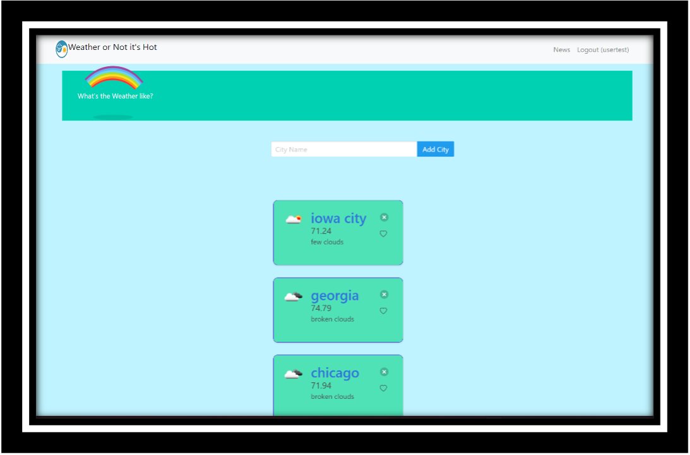
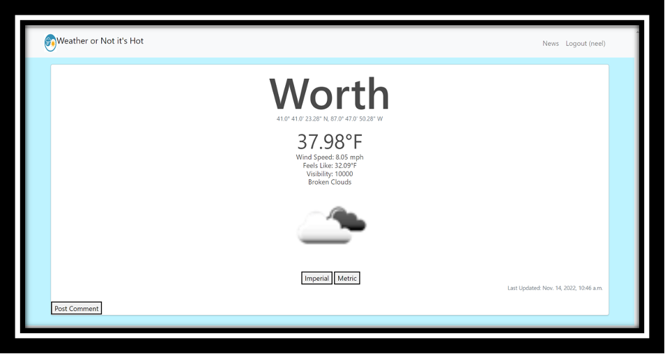
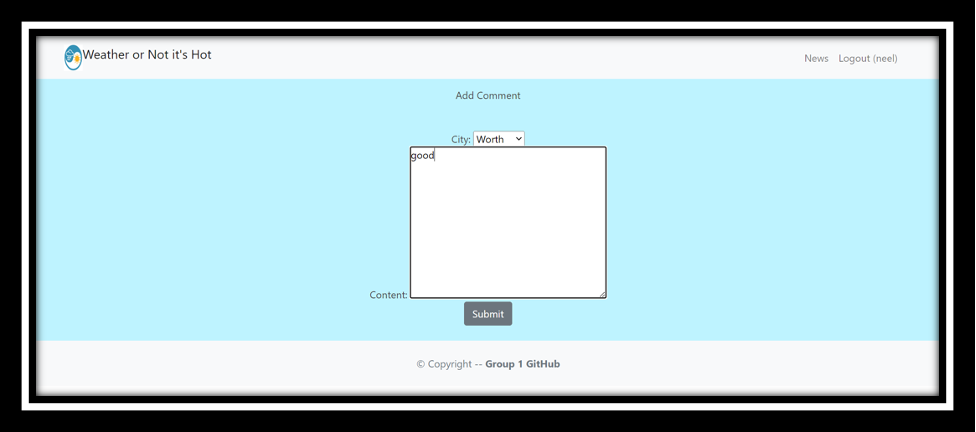
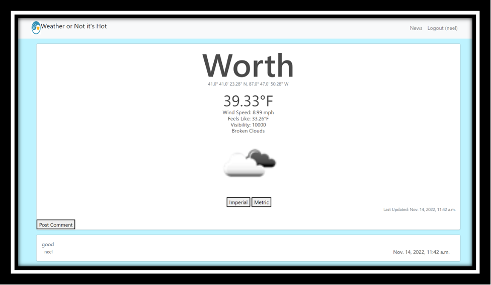

# Basic Weather Application
- This application is longer live. 
- The images below show the applications functionality 
### Technologies Included:
  - Amazon Web Services to host the site (EC2) and the Relational database (postgres)
  - Reverse proxy with nginx
  - Gunicorn to manage daemons 




<h3> How to use the requirments.txt file ? </h3>
<h4>Work Environemrents: Saving and Re-creating</h4>
<p> 
In our group project scenario, we use virtual environments so we do not have to globally install Django on our machines which could possibly lead to version conflicts.  It is also a helpful way to organize and manage project dependencies. 
</p>
<h6>Saving</h6>
<p>
from within a virtualenv use 
 </p>
 
```shell
  pip freeze > requirements.txt 
```

<h6>Re-create Workspace</h6>
<p>
  from within a virtualenv use
</p>

```shell
  pip install -r requirements.txt 
```

Credit for the rainbow animation:
<br>
https://fabrizio.io/
<br>
https://twitter.com/_fbrz
